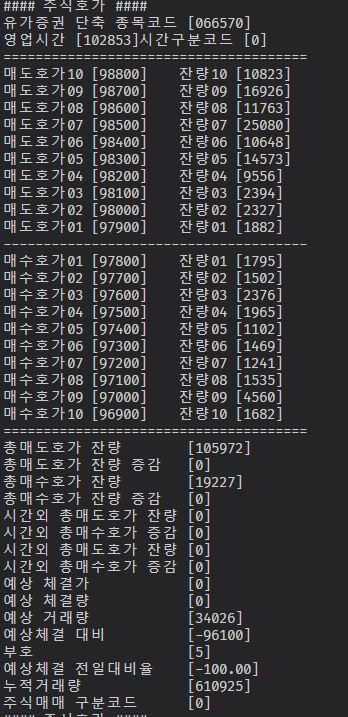

# 사용법
## 환경 설정
```bash
# 사용 파이썬 버전 3.9.18
# 필요 라이브러리 설치
pip install -r requirements.txt

# mongodb 6.0.10 버전 설치 
##  mongodb://127.0.0.1:27017

```

token 경로에 있는 kis_devlp.yaml에 한국 투자 증권에서 발급받은 api key 적어 넣기
```bash
paper_app : ""  # 모의투자용 앱키
paper_sec : ""  # 모의투자용 앱시크리트

```

## 실행

```bash
python customRealTime.py

```

## 결과
  

output/raw 에 받은 raw 데이터를 txt 형식으로 저장한다. 